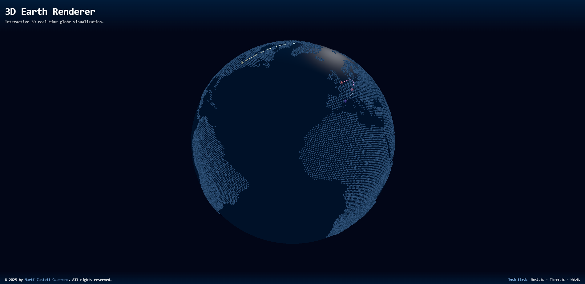

# 3D Earth Renderer

This is a **Next.js** project that renders an interactive **3D real‑time globe** using **Three.js** and **WebGL**.

---



---

## Getting Started

First, install dependencies:

```bash
npm install
```

Then, run the development server:

```bash
npm run dev
```

Open **[http://localhost:3000](http://localhost:3000)** in your browser to see the project running.

## Tech Stack

- **Next.js (Typescript)**
- **Three.js & WebGL**

## Learn More

To learn more about the technologies used:

- **Next.js [Documentation](https://nextjs.org/docs)**
- **Three.js [Documentation](https://threejs.org/docs)**
- **WebGL [Documentation](https://developer.mozilla.org/en-US/docs/Web/API/WebGL_API)**

---

© 2025 **Martí Castell Guerrero** · All rights reserved.
